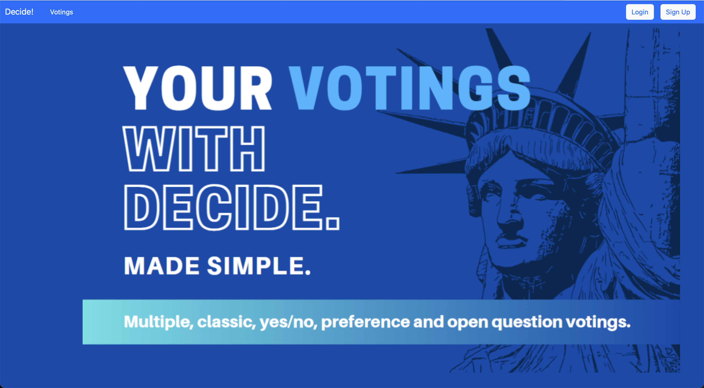
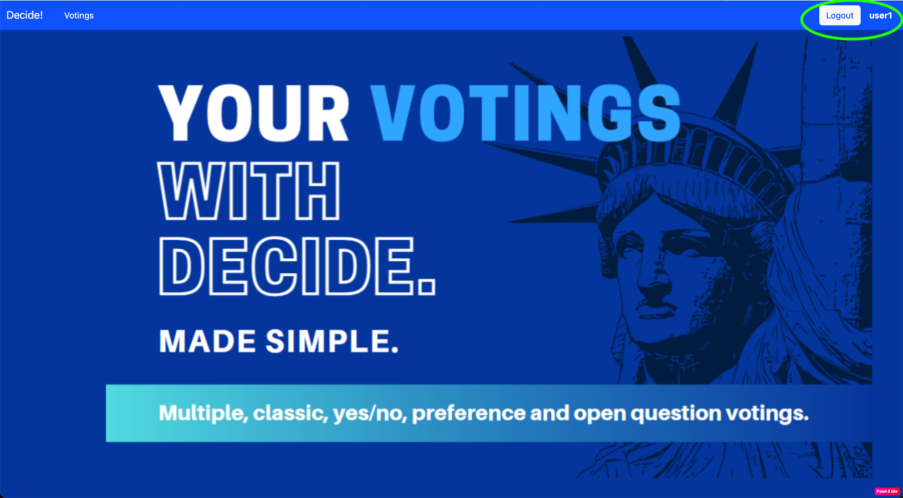
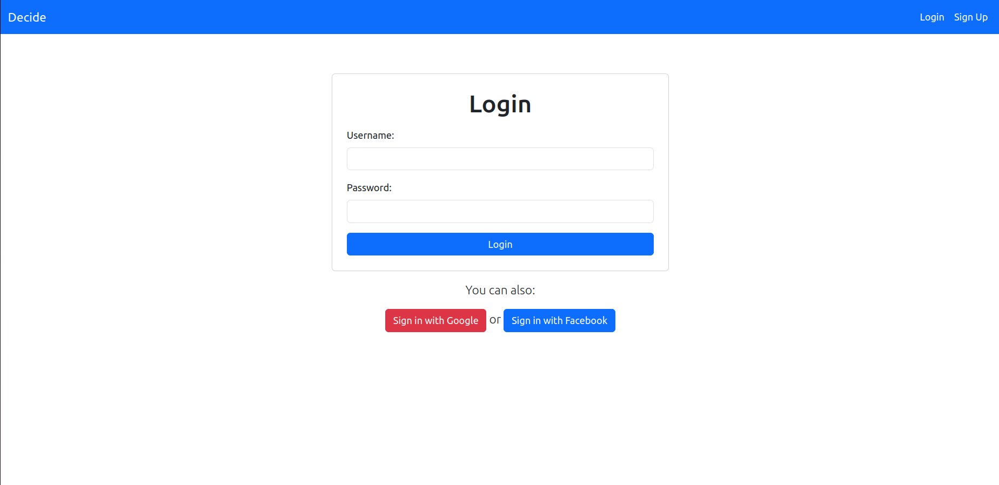
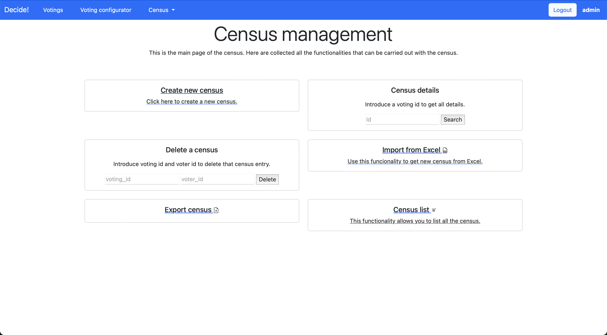
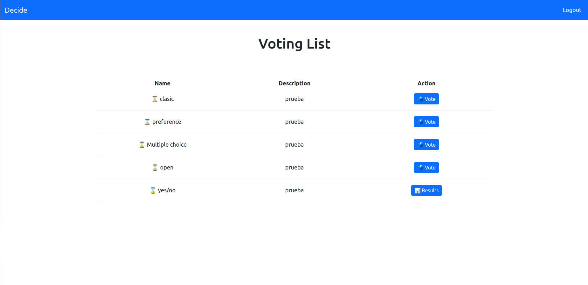
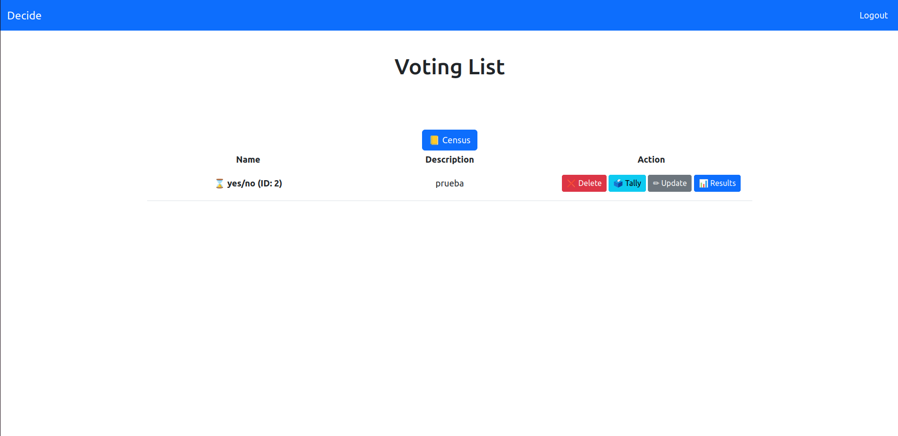

[](https://travis-ci.com/wadobo/decide) [](https://www.codacy.com/gh/decide-update-4-1/decide-update-4.1/dashboard?utm_source=github.com&amp;utm_medium=referral&amp;utm_content=decide-update-4-1/decide-update-4.1&amp;utm_campaign=Badge_Grade) [](https://www.codacy.com/gh/decide-update-4-1/decide-update-4.1/dashboard?utm_source=github.com&utm_medium=referral&utm_content=decide-update-4-1/decide-update-4.1&utm_campaign=Badge_Coverage)

Plataforma voto electrónico educativa
=====================================

El objetivo de este proyecto es implementar una plataforma de voto
electrónico seguro, que cumpla una serie de garantías básicas, como la
anonimicidad y el secreto del voto.

Se trata de un proyecto educativo, pensado para el estudio de sistemas de
votación, por lo que prima la simplicidad por encima de la eficiencia
cuando sea posible. Por lo tanto se asumen algunas carencias para permitir
que sea entendible y extensible.

Esta versión de Decide implementa 5 tipos de votaciones posibles:
* Votación clasica
* Votación de respuesta con múltiple opción
* Votación con respuesta si/no
* Votación por orden de preferencia
* Votación de respuesta abierta


Subsistemas, apps y proyecto base
---------------------------------

El proyecto se divide en [subsistemas](doc/subsistemas.md), los cuales estarán desacoplados
entre ellos. Para conseguir esto, los subsistemas se conectarán entre si mediante API y necesitamos un proyecto base donde configurar las ruts de estas API.

Este proyecto Django estará dividido en apps (subsistemas y proyecto base), donde cualquier app podrá ser reemplazada individualmente.

Gateway
---------

Para ofrecer un punto de entrada conocido para todos los subsistemas
existe el llamado **gateway** que no es más que una ruta disponible
que redirigirá todas las peticiones al subsistema correspondiente, de
tal forma que cualquier cliente que use la API no tiene por qué saber
en qué servidor está desplegado cada subsistema.

La ruta se compone de:

    http://DOMINIO/gateway/SUBSISTEMA/RUTA/EN/EL/SUBSISTEMA

Por ejemplo para acceder al subsistema de autenticación y hacer la petición
al endpoint de /authentication/login/ deberíamos hacer la petición a la
siguiente ruta:

    http://DOMINIO/gateway/authentication/login/

Otro ejemplo sería para obtener una votación por id:

    http://DOMINIO/gateway/voting/?id=1

A nivel interno, el módulo `mods` ofrece esta funcionalidad, pero el
gateway es útil para hacer uso desde peticiones de cliente, por ejemplo
en el javascript de la cabina de votación o la visualización de resultados,
y también para módulos externos que no sean aplicaciones django.

Configurar y ejecutar el proyecto
---------------------------------

Para configurar el proyecto, podremos crearnos un fichero local_settings.py basado en el
local_settings.example.py, donde podremos configurar la ruta de nuestras apps o escoger que módulos
ejecutar.

Una vez hecho esto, será necesario instalar las dependencias del proyecto, las cuales están en el
fichero requirements.txt:

    pip install -r requirements.txt

Tras esto tendremos que crearnos nuestra base de datos con postgres:

    sudo su - postgres
    psql -c "create user decide with password 'decide'"
    psql -c "create database decide owner decide"
    psql -c "ALTER USER decide CREATEDB"

Entramos en la carpeta del proyecto (cd decide) y realizamos la primera migración para preparar la
base de datos que utilizaremos:

    ./manage.py migrate

Creamos el superusuario, que será el administrador del sistema. Con este usuario podremos tener acceso 
a todas las funcionalidades ofrecidas por Decide, como por ejemplo crear usuarios. El comando es el 
siguiente:

    ./manage.py createsuperuser

Por último, ya podremos ejecutar el módulos o módulos seleccionados en la configuración de la
siguiente manera:

    ./manage.py runserver

Tests
-------------------

Una vez configurado postgres y ejecutado el migrate.

Para ejecutar todos los tests disponibles

    $./manage.py test

Para ejecutar los tests que pertenecen a una categoria como “voting”, por ejemplo

    $./manage.py test voting

Para ver la cobertura del codigo que estos tests prueban, se puede lanzar el siguiente comando:

    coverage run --source . ./manage.py test -v 2

Esto generará un "index.html", que se puede consultar para ver de forma especifica las partes del codigo no testeadas.


Guía rápida
-------------------

Aclaración: En esta guía vamos a usar como url de base: "localhost:8000".

### 1. Página de inicio de Decide

Una vez iniciada la aplicación, si accedemos a http://localhost:8000/ podremos ver la página de inicio de Decide. En ella podremos iniciar sesión si ya tenemos un usuario o podremos registrarnos. Si tenemos un usuario administrador, podremos iniciar sesión directamente con dicho usuario.



Si hemos inciado sesión correctamente, nos debería aparecer la siguiente vista:



SI hemos iniciado sesión con administrador, nos aparece la siguiente vista:


### 2. Autenticación de usuarios

Si en la página de inicio pulsamos el botón register, nos debería llevar al siguiente formulario para registrarnos en Decide:


Una vez registrados correctamente, deberemos iniciar sesión en Decide para empezar a utilizar la aplicación. El formulario que aparece es el siguiente, dónde también podremos identificarnos en Decide usando nuestra cuenta de Google o Facebook: 




### 3. Creación de las votaciones

Iniciamos sesión como administrador y pulsamos el botón voting configurator para abrir la vista de gestión de votaciones:


Podremos crear una votación de cada tipo. Para crear una votación tipo clásica tenemos que rellenar el siguiente formulario indicando un nombre, una descripción, la pregunta que queremos hacer y opcionalmente podemos indicar una fecha de fin de votación. También, podemos crear las opciones de respuesta a la pregunta que hemos realizado y podremos añadir más opciones:


Para crear una votación de tipo si/no tendremos que indicar simplemente la pregunta que queremos realizar, ya que las opciones se crean automáticamente:


Para crear una votación por preferencia o una votación de múltiple respuesta hacemos lo mismo que para la votación clásica rellenando los siguientes formularios:


Para crear una votación de respuesta abierta, simplemente creamos una votación indicando la pregunta que queremos realizar:


Una vez creada nos aparecerá esta vista para configurar el censo de la votación, pero podremos hacerlo mas tarde.


### 4. Creación del censo

Una vez creada la votacion, debemos añadir un censo para que los usuarios puedan registrar sus votaciones. Para ello, estando logueado como administrador pulsamos el botón list votings y luego pulsamos el botón census. Esto nos llevará a la vista de gestión del censo:



En esta vista podremos crear un nuevo censo indicando el id de la votación y el id del votante:


También podremos eliminar a una persona del censo, ver los detalles del censo de una votación, importar un censo a partir un archivo excel así como exportar un censo ya existente. También, podremos listar todos los censos que tenemos creados.

### 5. Inciar y gestionar una votación
Una vez añadido el censo, si pulsamos en el botón list votings de la página de inicio podremos ver todas las votaciones creadas por el adminsitrador y nos llevará a la vista de gestión de votaciones. En esta vista podremos finalizar, eliminar y editar una votación. 


A partir de este momento, los usuarios registrados en el censo ya pueden votar en todas las votaciones que aparezcan en dicha vista. 

### 6. Votar en los diferentes tipos de votaciones
Una vez inciada la votación, los usarios del censo podrán registrar su voto. Para ello, iniciamos sesión con un usuario y pulsamos el botón list votings. En la vista que nos aparece, sólo aparecen las votaciones en las que ese usuario está incluido en el censo. Para votar, simplemente pulsamos en el botón vote. Si la votación ya ha finalizado, podremos ver los resultados de dicha votación pulsando en el botón results.



Dependiendo del tipo de votación, nos aparecerá la cabina de votación correspondiente.

* Votación clásica: simplemente seleccionamos una de las opciones y registramos nuestro voto.


* Votación de múltiple opción: podremos seleccionar varias opciones y registar nuestro voto.


* Votación si/no: seleccionamos la opción Si o No y registramos nuestro voto.


* Votación por preferencia: seleccionamos cada opción estableciendo un orden de preferencia.


* Votación de respuesta abierta: podremos responder a la votación escribiendo lo que queramos en el cuadro de texto.


### 7. Realizar el conteo de votos
Una vez que todos los usarios han votado, accedemos como administrador a la vista de gestión de votaciones. Para ello, pulsamos en el votón list votings de la página de incio. Primero hay que finalizar la votación, para ello pulsamos en el botón End Voting. 

Una vez finalizada la votación, pulsamos en el botón Tally para realizar el conteo de los votos.



### 8. Visualizar los resultados

Una vez contados todos los votos, podremos visualizar los resultados pulsando en el botón Results. Por ejemplo, si visualizamos los resultados de la votación yes/no nos aparecerá una tabla con la puntuación y el número de votos para cada opción. Además disponemos de diferentes gráficos para visualizar los resultados.


Además, mientras la votación está en curso podemos ver los resultados en tiempo real sin finalizar la votación.


Ejecutar con docker
-------------------

Existe una configuración de docker compose que lanza 3 contenedores, uno
para el servidor de base de datos, otro para el django y otro con un
servidor web nginx para servir los ficheros estáticos y hacer de proxy al
servidor django:

 * decide\_db
 * decide\_web
 * decide\_nginx

Además se crean dos volúmenes, uno para los ficheros estáticos y medias del
proyecto y otro para la base de datos postgresql, de esta forma los
contenedores se pueden destruir sin miedo a perder datos:

 * decide\_db
 * decide\_static

Se puede editar el fichero docker-settings.py para modificar el settings
del proyecto django antes de crear las imágenes del contenedor.

Crear imágenes y lanzar contenedores:

    $ cd docker
    $ docker-compose up -d

Parar contenedores:

    $ docker-compose down

Crear un usuario administrador:

    $ docker exec -ti decide_web ./manage.py createsuperuser

Lanzar la consola django:

    $ docker exec -ti decide_web ./manage.py shell

Lanzar tests:

    $ docker exec -ti decide_web ./manage.py test

Lanzar una consola SQL:

    $ docker exec -ti decide_db ash -c "su - postgres -c 'psql postgres'"

Ejecutar con vagrant + ansible
------------------------------

Existe una configuración de vagrant que crea una máquina virtual con todo
lo necesario instalado y listo para funcionar. La configuración está en
vagrant/Vagrantfile y por defecto utiliza Virtualbox, por lo que para
que esto funcione debes tener instalado en tu sistema vagrant y Virtualbox.

Crear la máquina virtual con vagrant:

    $ cd vagrant
    $ vagrant up

Una vez creada podremos acceder a la web, con el usuario admin/admin:

http://localhost:8080/admin

Acceder por ssh a la máquina:

    $ vagrant ssh

Esto nos dará una consola con el usuario vagrant, que tiene permisos de
sudo, por lo que podremos acceder al usuario administrador con:

    $ sudo su

Parar la máquina virtual:

    $ vagrant stop

Una vez parada la máquina podemos volver a lanzarla con `vagrant up`.

Eliminar la máquina virtual:

    $ vagrant destroy

Ansible
-------

El provisionamiento de la aplicación con vagrant está hecho con Ansible,
algo que nos permite utilizarlo de forma independiente para provisionar
una instalación de Decide en uno o varios servidores remotos con un
simple comando.

    $ cd vagrant
    $ ansible-playbook -i inventory playbook.yml

Para que esto funcione debes definir un fichero [inventory](https://docs.ansible.com/ansible/latest/user_guide/intro_inventory.html)
con los servidores destino.

Los scripts de ansible están divididos en varios ficheros .yml donde
se definen las diferentes tareas, por lo que es posible lanzar partes
independientes:

  * packages.yml, dependencias del sistema
  * user.yml, creación de usuario decide
  * python.yml, git clone del repositorio e instalación de dependencias python en virtualenv
  * files.yml, ficheros de configuración, systemd, nginx y local\_settings.py
  * database.yml, creación de usuario y base de datos postgres
  * django.yml, comandos django básicos y creación de usuario admin
  * services.yml, reinicio de servicios, decide, nginx y postgres

Por ejemplo este comando sólo reinicia los servicios en el servidor:

    $ ansible-playbook -i inventory -t services

El provisionamiento de ansible está diseñado para funcionar con **ubuntu/bionic64**,
para funcionar con otras distribuciones es posible que haga falta modificar
el fichero packages.yml.

Versionado
----------

El versionado de API está hecho utilizando Django Rest Framework, y la forma
elegida para este versionado es mediante [parámetros de búsqueda](https://www.django-rest-framework.org/api-guide/versioning/#queryparameterversioning),
podemos cambiarlo a parámetros en la URL o en el nombre del HOST, hay diferentes
tipos de versionado disponibles en Django Rest Framework, podemos verlos
[aqui](https://www.django-rest-framework.org/api-guide/versioning/#versioning).

Nosotros hemos escogido el de por parámetros por ser el más sencillo, y hemos
creado un ejemplo para que veamos su uso, podemos verlo en voting/views.py

Si nosotros queremos que la salida que nos da la llamada a la API /voting/, sea
diferente en la versión 2, solo tenemos que comprobar en la versión nos está
llegando, y hacer lo que queramos, por ejemplo:


```
    def get(self, request, *args, **kwargs):
        version = request.version  # Con request.version obtenemos la versión
        if version not in settings.ALLOWED_VERSIONS:  # Versiones permitidas
            version = settings.DEFAULT_VERSION  # Si no existe: versión por defecto
        # En el caso de usar la versión 2, usamos un serializador diferente
        if version == 'v2':
            self.serializer_class = SimpleVotingSerializer
        return super().get(request, *args, **kwargs)
```

Para llamar a las diferentes versiones, haremos lo siguiente:

* /voting/?version=v1
* /voting/?version=v2


Test de estrés con Locust
-------------------------

Antes de empezar, comentaré para que sirven las pruebas de estrés. A veces necesitamos soportar que
nuestra aplicación ofrezca una cantidad de peticiones por segundo, porque habrá mucha gente entrando
a la misma vez, y ante este estrés, tenemos que comprobar como se comporta nuestra aplicación.

No es lo mismo que cuando la estresemos nos de un error 500 a que nos devuelva la petición de otro
usuario. Con estos test conseguiremos comprobar cual es ese comportamiento, y quizás mejorar la
velocidad de las peticiones para permitir más peticiones por segundo.

Para ejecutar los test de estrés utilizando locust, necesitaremos tener instalado locust:

    $ pip install locust

Una vez instalado, necesitaremos tener un fichero locustfile.py donde tengamos la configuración de
lo que vamos a ejecutar. En nuestro caso, tenemos hecho dos ejemplos:

1. Visualizer: entra en el visualizador de una votación para ver cuantas peticiones puede aguantar.

    Para ejecutar el test de Visualizer, tenemos que tener en cuenta que entra en la votación 1, por lo
    que necesitaremos tenerla creada para que funcione correctamente, una vez hecho esto, podemos
    comenzar a probar con el siguiente comando (dentro de la carpeta loadtest):

        $ locust Visualizer

    Esto abrirá un servidor que podremos ver en el navegador, el mismo comando nos dirá el puerto.
    Cuando se abra, nos preguntará cuantos usuarios queremos que hagan peticiones a la vez, y como
    queremos que vaya creciendo hasta llegar a ese número. Por ejemplo, si ponemos 100 y 5, estaremos
    creando 5 nuevos usuarios cada segundo hasta llegar a 100.

2. Voters: utilizaremos usuarios previamente creados, y haremos una secuencia de peticiones: login,
getuser y store. Sería lo que realizaría un usuario cuando va a votar, por lo que con este ejemplo
estaremos comprobando cuantas votaciones podemos hacer.


    Para ejecutar el test de Voter, necesitaremos realizar varios preparos. Necesitaremos la votación 1
    abierta, y necesitaremos crear una serie de usuarios en el censo de esta votación, para que cuando
    hagamos el test, estos usuario puedan autenticarse y votar correctamente. Para facilitar esta
    tarea, hemos creado el script de python gen_census.py, en el cual creamos los usuarios que
    tenemos dentro del fichero voters.json y los añadimos al censo utilizando la librería requests.
    Para que este script funcione, necesitaremos tener instalado request:

        $ pip install requests

    Una vez instalado, ejecutamos el script:

        $ python gen_census.py

    Tras esto, ya podremos comenzar el test de estrés de votantes:

        $ locust Voters

Importante mirar bien el fichero locustfile.py, donde existen algunas configuraciones que podremos
cambiar, dependiendo del HOST donde queramos hacer las pruebas y del id de la votación.

A tener en cuenta:

* En un servidor local, con un postgres que por defecto nos viene limitado a 100 usuarios
  concurrentes, cuando pongamos más de 100, lo normal es que empiecen a fallar muchas peticiones.
* Si hacemos las pruebas en local, donde tenemos activado el modo debug de Django, lo normal es que
  las peticiones tarden algo más y consigamos menos RPS (Peticiones por segundo).

Poblar con datos iniciales
--------------------------

Para probar el correcto funcionamiento de nuestra aplicación de decide, hemos generado una serie de
datos iniciales. Para ello, hemos elaborado un archivo JSON con datos que Django usa para generar 
varias votaciones y usuarios de manera automática. Este se ha dotado con el nombre de "populate.json"
y se ha colocado junto a "manage.py". Lo pasos a seguir son los comentados abajo.

Para borrar posibles datos en base de datos generados por el usuario, se recomienda ejecutar:

    ./manage.py flush

Tras esto, poblamos la base de datos con datos iniciales de la siguiente manera:

    ./manage.py loaddata populate.json

Se ha creado un usuario staff con las credenciales:

* Usuario: admin
* Contraseña: admin

Por otra parte, el resto de usuarios (3 restantes) siguen la siguiente secuencia:

* Usuario: usuario#
* Contraseña: practica#

donde # es la sucesión desde el valor 1 hasta el 3.

En cuanto a las votaciones, se ha creado una votación cerrada con su correspondiente conteo,
una votación abierta con la que podemos interactuar y una votación que no se ha iniciado,
cubriendo así todas las posibilidades.
Si se quieren añadir más casuística a la carga inicial, basta con editar el "populate.json" siguiendo 
la misma estructura que los datos contenidos en el mismo.


Cabe añadir que previo a ejecutar ambos comandos, deberemos haber activado nuestro entorno de 
Python 3.9.


El archivo "populate.json" se ha generado manualmente con ayuda de la documentación encontrada en
[el siguiente portal web](https://docs.djangoproject.com/en/4.1/howto/initial-data/).

Versiones actuales
------------------

En las ultimas actualizaciones se han modificado las versiones usadas por la aplicación Decide. Las 
versiones usadas actualmente se corresponden a las siguientes:

Django==4.1
pycryptodome==3.15.0
djangorestframework==3.14.0
django-cors-headers==3.13.0
requests==2.28.1
django-filter==22.1
psycopg2==2.9.4
pynose==1.4.8
coverage==6.5.0
jsonnet==0.18.0
django-nose==1.4.6
django-rest-swagger==2.2.0
selenium==4.7.2
pynose==1.4.8
dj-database-url==2.1.0
whitenoise==6.5.0
gunicorn==21.2.0
social-auth-app-django==5.4.0
social-auth-core==4.5.0
openpyxl==3.1.2
